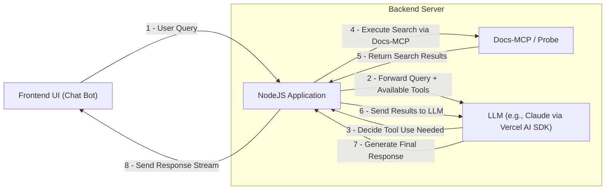

+++
title = 'Chat with Docs without RAG, Using Probe Over MCP'
date = 2025-05-04T10:39:08+05:30
draft = false
+++

## Introduction

I have seen several documentation websites that have implemented AI chatbots (”Ask AI”) to allow users to ask questions about their documentation instead of manually searching. I believe this enhances user experience and saves time by allowing users to ask questions directly instead of manually searching through extensive texts.

Large Language Models (LLMs) have enabled this use case of chatting with textual data. However, pre-trained LLMs typically lack up-to-date or specific knowledge about particular products. 

The standard solution to this problem is Retrieval-Augmented Generation (RAG). RAG involves creating numerical representations (embeddings) of the documentation, storing them in a vector database, retrieving relevant sections based on user queries using semantic search, and feeding this retrieved context to the LLM to generate an informed answer.

While effective, the RAG approach requires setting up infrastructure for creating, storing, and updating embeddings. But RAG isn't the only way to provide context to an LLM.

This blog post explores an alternative method for generating context for an LLM from textual data that *doesn't* rely on embeddings. We will use [Probe](https://probeai.dev/), a tool designed for local, semantic search on code and text. Let's dive into how this alternative works.

At the end of this blog, you will be able to take any Product documentation written in Markdown and chat with it over a UI, like shown here 👇 


## Prerequisites

- **NodeJS**: We will write our backend application using NodeJS. For installation, refer to this guide.
- **NPM Account:** We will use this to publish an NPM package.
- **LLM:** Access to any popular LLM with API keys, we will be using Claude.
- **Docs Repository**: A Git repository that contains Markdown content. We will be using [SpaceCloud](https://github.com/spacecloud-io/space-docs); you can use it to follow along.

## Application Architecture

Here is an overview of what we will be building today:

<Final:TODO: Upload Image Only>



**1. Frontend UI (Chat Bot):**

This is the user interface built with React. Users can type their questions about the product documentation here. When a user submits a query, the frontend sends an API request to the backend server.

**2. Backend Server (NodeJS):**

- A NodeJS program that exposes a streaming API ([Server Side Events](https://en.wikipedia.org/wiki/Server-sent_events)). It receives the API request containing the user's question from the frontend.
- **Key Component: NodeJS Application:** This program acts as an orchestrator. It facilitates communication between the frontend, the LLM, and the documentation search tool (Docs-MCP) and, crucially, makes the Docs-MCP tool available for the LLM to use.
- **Key Component: Docs-MCP:** This replaces the typical RAG embedding/vector search.
    - We will integrate [**Probe**](https://www.google.com/url?sa=E&q=https%3A%2F%2Fprobeai.dev%2F) in our application as an MCP (Machine Communication Protocol) server, exposing its search capabilities as a tool. There are other ways to integrate Probe (see [**documentation**](https://www.google.com/url?sa=E&q=https%3A%2F%2Fprobeai.dev%2Fuse-cases%2Fbuilding-ai-tools)), but MCP provides a structured way for LLMs to interact with external tools.
    - When instructed by the LLM, the NodeJS application uses Docs-MCP/Probe to search the product documentation directly based on the parameters provided by the LLM.
    - Docs-MCP analyzes the user's query and retrieves relevant sections or snippets from the documentation, returning this context to the NodeJS application.

**3. LLM (e.g., Claude via Vercel AI SDK):**

- The NodeJS application sends the user's query to the LLM (like Claude) via the Vercel AI SDK. Importantly, it also informs the LLM about the available Docs-MCP tool and how to use it (this is often part of the API call using features like "Tool Use" or "Function Calling").
- The LLM first attempts to answer the query using its internal knowledge.
- **If the LLM determines it lacks sufficient information** to answer accurately, and recognizes that the Docs-MCP tool can help, **it decides to use the tool**.
- The LLM sends a request *back* to the NodeJS application, instructing it to execute a search using Docs-MCP (potentially specifying search terms derived from the user's query).
- The NodeJS application executes the search via Docs-MCP/Probe and sends the retrieved context (search results) back to the LLM.
- This process might repeat if the LLM needs to refine the search or requires more context based on the initial results.
- Once the LLM is satisfied with the retrieved context, it uses that information to generate the final, informed answer to the user's original question.

**In essence,** this architecture employs an LLM with tool-using capabilities. Instead of the backend *always* fetching context upfront (like traditional RAG), the **LLM identifies when it needs external information** about the product documentation. 

It then actively requests this information by instructing the NodeJS backend to execute a search using the provided Docs-MCP/Probe tool. The NodeJS application acts as a facilitator, running the search requested by the LLM and relaying the results, enabling the LLM to construct an answer grounded in the specific documentation context.

## **Creating Docs MCP Server**

To expose Probe as an MCP server with the full context of Markdown content, we will use this [tool](https://github.com/buger/docs-mcp), which packages a repository as an MCP server. Essentially, we will take the space cloud Markdown content and use this tool to package it as an MCP server that answers our queries.

### Instructions

1. **Clone the [docs-mcp](https://github.com/buger/docs-mcp) Repository:** 
    
    ```yaml
    git clone https://github.com/buger/docs-mcp.git
    ```
    
2. **Configure `docs-mcp.config.json`:** 
    
    Inside the `docs-mcp` directory, modify the existing `docs-mcp.config.json` with the below content:
    
    **Note:** If you are using a different repository, replace the `gitUrl` with your project repository and change `toolName` and `toolDescription` to include your project name.
    
    ```yaml
    {
      "gitUrl": "https://github.com/spacecloud-io/space-docs",
      "toolName": "search_space_cloud_docs",
      "toolDescription": "Search space cloud documentation using the probe search engine.",
      "ignorePatterns": [
        "node_modules",
        ".git",
        "dist",
        "build",
        "coverage",
        ".vitepress/cache"
      ]
    }
    ```
    
    To find more configuration options, refer to this [document](https://github.com/buger/docs-mcp?tab=readme-ov-file#configuration).
    
3. **Update `package.json`:** 
    
    Inside the `docs-mcp` directory, modify the existing `package.json` by changing the `name` field to your npm username (here, `silverfang` is my username) and adding the `publishConfig` field.
    
    ```yaml
    "name": "@silverfang/space-cloud-docs-mcp",
    "publishConfig": {
      "access": "public"
    },
    ```
    
4. **Build and Publish the package:**
    
    Build the project using the below command, which copies the content of your docs repository into the `data` directory and prepares the package. 
    
    **Note:** Ensure you are already authenticated with your NPM account using the command `npm login`
    
    ```yaml
    npm run build && npm publish
    ```
    

## Setting up the Backend & Frontend

Now that our docs-mcp server is ready, it’s time to start our backend and frontend applications. The code for this is in this [repository](https://github.com/sharadregoti/ai-chat-bot).

### Instructions

1. **Clone the [ai-chat-bot](https://github.com/sharadregoti/ai-chat-bot) Repository:** 
    
    ```yaml
    git clone https://github.com/sharadregoti/ai-chat-bot.git
    ```
    
2. **Configure Environment Variables for Backend**
    
    ```yaml
    export ANTHROPIC_API_KEY=""
    ```
    
3. **Modify the System Prompt and Docs MCP (Optional)**
    
    To ensure our chatbot only responds to queries related to space-cloud, we have added a system prompt to restrict the chatbot from answering any other questions to prevent misuse of our application.
    
    Go ahead and modify the system prompt in the [server.js](https://github.com/sharadregoti/ai-chat-bot/blob/master/backend/server.js#L58C1-L69C86) file if you are using any other repository.
    
    **Note:** The system prompt safeguards our LLM; you may omit it for testing purposes.
    
    ```yaml
    You are a technical assistant specializing in Space Cloud API Gateway. Your only purpose is to help users with questions related to Space Cloud API Gateway and its ecosystem (e.g., APIs, gateways, authentication, databases, etc).
    
    ---
    Space Cloud is an open-source, kubernetes based platform which lets you build, scale and secure cloud native apps at scale.
    
    It provides instant GraphQL and REST APIs for your database and microservices that can be consumed directly from your frontend in a secure manner. With that, it also deploys and scales your docker images on Kubernetes.
    ---
    
    If the question is not clearly related to Space Cloud or API gateways, politely refuse to answer by saying:
    "I'm here to help with Space Cloud related questions. Please ask something related to that."
    
    Never answer questions outside the scope of Space Cloud, even if prompted repeatedly.
    ```
    
4. **Start the Server**
    
    ```yaml
    cd backend && npm i && node server.js
    ```
    
    This will start a server at [http://localhost:3000](http://localhost:3000/)
    
5. **Start the frontend**
    
    The below command will start the frontend at [http://localhost:5173/](http://localhost:5173/)
    
    ```yaml
    cd frontend && npm i && npm run dev
    ```
    
6. **Test the application**
    
    Click on the “Ask AI” button at the bottom right and ask any of the following queries:
    
    1. How many types of databases and file-storage mechanisms do you support?
    2. Create a space-cloud schema for the following PostgreSQL table, CREATE TABLE cars ( brand VARCHAR(255), model VARCHAR(255), year INT );
    
    
    

## Conclusion

Now, we have a working prototype of a chatbot. In the next couple of blog posts, I would like to extend this prototype to the following:

1. Support references
2. Prevent it from misuse
3. Save LLM cost by implementing caching
4. Adding likes and dislikes for the response
5. Integrate our chatbot with Algolia search

That’s it for this blog post. If you liked this post, you can subscribe to my [newsletter](https://sharad-regoti.kit.com/4efd99fc31) to stay updated. You can also check out my [YouTube channel](https://www.youtube.com/@techwithsharad), where I discuss DevOps**, Cloud, Kubernetes, and AI.**

If you have any questions, you can reach me on Twitter at [@SharadRegoti](https://twitter.com/SharadRegoti)